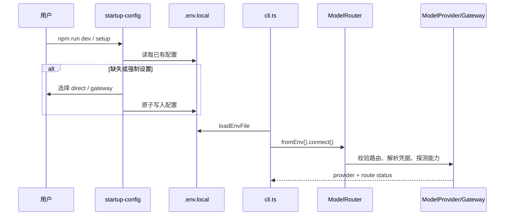
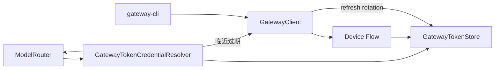

# 启动、配置、凭据与模型路由链路

> [返回功能链路索引](./README.md) | 适用版本：v0.7 | 更新日期：2026-09-03

## 1. 触发入口

- `npm run dev`：进入 `src/cli.ts`，必要时先运行设置向导。
- `npm run setup`：强制重跑设置向导，只更新本地配置。
- `npm run gateway:login|refresh|logout|status`：进入 `src/gateway-cli.ts`。

## 2. 启动数据流



## 3. `.env.local` 数据字典

### Direct 路由

| Key | 含义 | 来源/默认 |
| --- | --- | --- |
| `AGENT_MODEL_ROUTE` | 固定为 `direct` | 向导 |
| `AGENT_DIRECT_MODEL` | 模型名 | 用户输入 |
| `AGENT_DIRECT_BASE_URL` | OpenAI-compatible HTTPS 地址 | 用户输入；loopback 可用 HTTP |
| `AGENT_DIRECT_PROTOCOL` | `chat_completions` 或 `responses` | 向导 |
| `AGENT_DIRECT_CREDENTIAL_REF` | 通常是 `env:AGENT_DIRECT_API_KEY` | 向导 |
| `AGENT_DIRECT_API_KEY` | 直连 API Key | 仅本机配置，不得提交 |
| `AGENT_DIRECT_PRIVACY` | 上下文投影级别 | 默认 `full-context` |
| `AGENT_DIRECT_STREAMING` | 是否流式 | 默认 `true` |
| `AGENT_WORKSPACE_ROOT` | 工作区根目录 | 当前目录或显式值 |

### Gateway 路由

| Key | 含义 | 说明 |
| --- | --- | --- |
| `AGENT_MODEL_ROUTE` | 固定为 `gateway` | 不与 Direct 自动回退 |
| `AGENT_GATEWAY_URL` | Gateway 地址 | 必须 HTTPS，loopback 例外 |
| `AGENT_GATEWAY_MODEL` | Gateway 模型目录中的模型 ID | 启动时校验 |
| `AGENT_GATEWAY_CREDENTIAL_REF` | `gateway-token:default` | 指向私有 Token Store |
| `AGENT_GATEWAY_PRIVACY` | 远程上下文投影 | 默认 `metadata` |
| `AGENT_GATEWAY_PRIVACY_CONFIRMED` | 已确认远程发送边界 | 必须为 `true` |

Gateway Access/Refresh Token 不写入 `.env.local`。

## 4. 路由判定

```text
AGENT_MODEL_ROUTE 缺失/非法 -> not_configured，启动失败并提示 setup
direct -> 校验 model/baseUrl/credentialRef/protocol -> 构造 OpenAICompatibleProvider
gateway -> 校验隐私确认 -> 解析 Token -> 查询模型目录 -> 构造 Gateway Provider
任一路由失败 -> 返回稳定 reasonCode；不会静默切换到另一条路由
```

`ModelProvider` 向 Runtime 暴露统一的 `complete/stream`、模型名和能力；Chat Completions 与 Responses 的请求/响应差异由 Codec 消化。

## 5. 凭据流

### Direct

`EnvironmentCredentialResolver` 解析 `env:<KEY>`，只把值交给 Provider 请求头，不进入 Session、工具输出或公开文档。

### Gateway



Token Store 字段：

| 字段 | 类型 | 含义 |
| --- | --- | --- |
| `accessToken` | string | 调用 Gateway 的 Bearer Token |
| `refreshToken` | string? | Access Token 续期凭据 |
| `expiresAt` | ISO string? | Access Token 到期时间 |
| `scope` | string[] | 授权范围 |

Windows 默认用当前用户 DPAPI 加密后写到 `%LOCALAPPDATA%/EchoLens/gateway-token.dpapi`；非 Windows 默认写到权限为 0600 的 `~/.echolens/gateway-token.json`。读取损坏或无法解密时返回“未登录”，不带着坏凭据继续启动。

## 6. 启动后的组件装配

1. 注册工作区和 Sandbox 工具。
2. 连接模型 Provider。
3. 初始化代码智能并连接启用的 MCP Server。
4. 创建审批 Store、子 Agent、后台队列和 Worker。
5. 创建 `ToolExecutor`、`ReactAgent`。
6. 打开新 Session 或 `--resume` 指定的 Session。
7. 根据 TTY 能力进入 Ink TUI 或 readline 行模式。

启动完成后，`WorkspaceRuntimeManager` 持有当前工作区运行时。用户执行 `/cd` 或 `/workspace` 时只重建工作区绑定的 Session、工具、扩展、审批和队列；模型路由与 Provider 连接继续复用。完整流程见[工作目录切换](./08-工作目录切换.md)。

## 7. 失败边界与测试

- Sandbox 配置在注册阶段就校验，无效时直接退出，不等到第一次命令才失败。
- 单个 MCP Server 失败只形成 notice，不阻断主 Agent。
- Session 不能跨工作区恢复。
- 关键测试：`startup-config.test.ts`、`model-router.test.ts`、`gateway-client.test.ts`、`gateway-token-store.test.ts`、`openai-compatible*.test.ts`。
