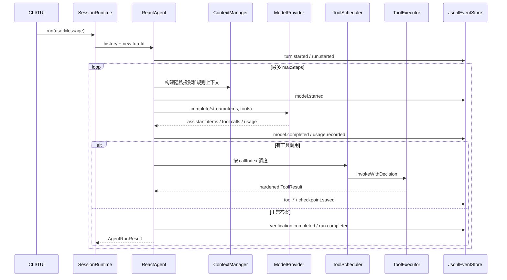

# 对话运行、工具调用与会话恢复链路

> [返回功能链路索引](./README.md) | 适用版本：v0.7 | 更新日期：2026-09-03

## 1. 一轮普通对话



## 2. 内部对话数据

`ConversationItem` 是 Session、Provider、Context、工具和恢复逻辑共用的协议：

| 类型 | 关键字段 | 作用 |
| --- | --- | --- |
| `message` | `id/role/content[]` | system、user、assistant 文本 |
| `tool_call` | `callId/name/arguments/callIndex/dependsOn?` | 模型提出的工具动作 |
| `tool_result` | `callId/toolName/status/output/summary/error/evidenceIds` | 工具结果；始终是 untrusted tool_output |

工具结果在进入模型上下文前经过脱敏、截断、内容哈希和 Guardrail 标记，不能提升权限或伪装成指令。

## 3. 工具执行前置网关

`ToolExecutor` 的固定顺序：

```text
查注册表 -> 调用预算 -> JSON Schema -> ProposedActionGuardrail
-> 需要时审批与审批记忆 -> 审批后再次占用预算 -> Abort 检查
-> 带超时/取消的 execute -> 输出加固 -> ToolResult
```

默认边界：单回合最多 24 次真实工具调用、单次 15 秒、单次结果最多 12000 字符。被未知工具、参数错误、审批等待、权限拒绝、预算拒绝拦下的调用不会误计成“已执行”。

## 4. 并发规则

- `effect=read` 且无 `dependsOn` 的调用组成只读批次，最多 4 并发。
- 写入、进程、网络、外部调用先等待只读批次结束，再单独串行执行。
- Provider 不支持并行工具时全部串行。
- 最终结果按 `callIndex` 排序，完成先后不会改变发回模型的顺序。

## 5. Session JSONL 数据字典

每行是一个 `AgentEvent`：

| 字段 | 含义 |
| --- | --- |
| `version` | 当前为 1 |
| `eventId` | UUID |
| `sessionId` | 会话 ID，也是文件名主体 |
| `turnId` | 用户回合 ID，可选 |
| `runId` | 一次运行/恢复 ID，可选 |
| `seq` | 从 1 连续递增，不允许缺口或乱序 |
| `timestamp` | ISO 时间 |
| `parentEventId` | 事件因果链前驱 |
| `payload` | 具体事件内容 |

事件组：

| 组 | 事件 |
| --- | --- |
| Session/Turn | `session.created`、`turn.started`、`turn.steered` |
| Run | `run.started/completed/paused/cancelled/failed` |
| Model | `model.started/output.delta/retry/completed/failed`、`usage.recorded` |
| Tool | `tool.started/progress/completed`、`workspace.file.observed` |
| 安全 | `guardrail.decision`、`approval.requested/decided` |
| 恢复/验证 | `checkpoint.saved`、`verification.completed` |

所有 payload 落盘前整体脱敏。默认 `flushEachEvent=true`，每条事件都会同步；若调用方显式关闭逐条同步，仍会强制同步 `checkpoint.saved` 和全部 `run.*` 终态事件。

## 6. AgentCheckpoint

| 字段 | 含义 |
| --- | --- |
| `sessionId/turnId/runId` | 恢复归属 |
| `step` | 当前模型步数 |
| `phase` | `model`、`tools` 或 `finished` |
| `toolCallsUsed` | 已占用工具预算 |
| `state` | running/completed/paused/cancelled/failed |
| `items` | 可重建的完整 `ConversationItem[]` |

工具批次执行前保存 `tools` 阶段检查点。崩溃恢复时只合并检查点之后已经落盘的 `tool.completed.result`，按 `callIndex` 补回，避免重复执行已经完成的副作用工具。

## 7. 暂停、取消、恢复与 steering

- 步数或工具预算耗尽：保存检查点，写 `run.paused`。
- 审批尚未得到决定：工具返回 `approval_required`，Run 可暂停等待显式恢复。
- `Ctrl+C`：中止模型或工具，写 `run.cancelled`，Session 文件保留。
- `/resume`：读取最后检查点，恢复预算和 items；已完成 Turn 不允许恢复。
- `/steer <内容>`：先写 `turn.steered` 并进入内存队列，下次模型请求前消费；重启后从最后检查点之后的 steering 事件重建未消费队列。

## 8. 损坏恢复

- 文件尾部半行：启动时截断到最后一个换行，视为崩溃未写完。
- 中间空行、非法 JSON、schema 错误、seq 不连续：抛 `event_store_corrupt`，不静默跳过。
- 单文件恢复上限 64 MiB。
- `<session>.jsonl.lock` 保证同一 Session 跨进程单写者。

## 9. 关键测试

`runtime.test.ts`、`tool-scheduler.test.ts`、`tool-errors.test.ts`、`guardrail.test.ts`、`jsonl-event-store.test.ts`、`session-runtime.test.ts`、`tui.test.ts`。
