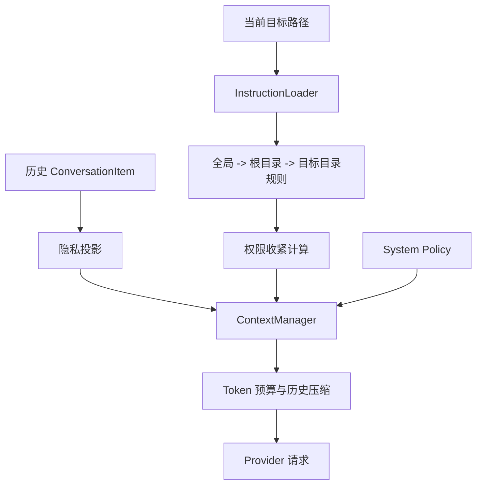
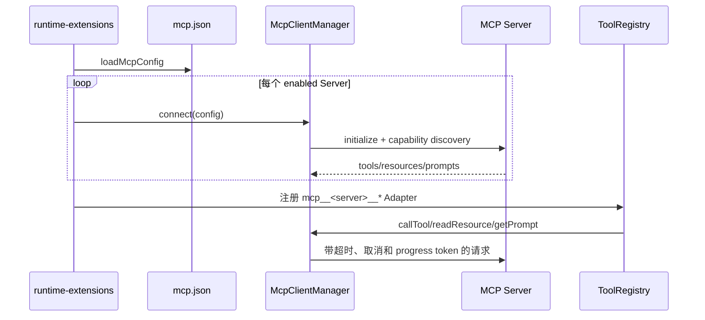

# 规则、上下文、MCP 与代码智能链路

> [返回功能链路索引](./README.md) | 适用版本：v0.7 | 更新日期：2026-09-03

## 1. 上下文构建



## 2. AGENTS 指令发现和权限

发现顺序为用户全局规则，再从项目根到目标文件目录逐层合并；每个目录只选择一个规则文件，优先 `AGENTS.override.md`，再 `AGENTS.md`，最后配置的 fallback。合并内容默认不超过 32 KiB。

规则文档包含来源、信任级别、作用域、内容哈希、截断和权限指令。规则中的权限效果只有：

- `deny`：移除运行时已经授予的权限。
- `request_approval`：把已有权限降为需要审批。

不存在 `allow`；规则不能新增权限。`deny` 优先于 `request_approval`。

## 3. 隐私投影

| 模式 | 工具结果发送给模型的内容 | `data` | evidenceIds |
| --- | --- | --- | --- |
| `full-context` | 原始已加固输出 | 保留 | 保留 |
| `evidence` | 状态、摘要、证据 ID、内容哈希、截断标志 | 清空 | 保留 |
| `metadata` | 状态、摘要、工具名 | 清空 | 清空 |

Context 先固定 System Policy 和规则前缀，再按最近 Turn 保留历史；超预算时把旧 Turn 折叠成 milestone summary，并继续缩短正文项，不移动或删除安全前缀。Token 预算按序列化字节数除以 4 近似估算，并为输出预留默认 4096 tokens。

## 4. MCP 配置数据字典

默认读取 `.echolens/mcp.json`：

| 字段 | 含义 |
| --- | --- |
| `version` | 固定 1 |
| `servers[].id` | 稳定 Server ID，参与本地工具命名 |
| `enabled` | 是否启动时连接 |
| `trust` | `untrusted` 或 `trusted` |
| `protocolMode` | `legacy`、`auto` 或固定版本 |
| `timeoutMs` | 单请求超时 |
| `permissions.tools` | 允许暴露的远程工具白名单 |
| `permissions.resources/prompts` | 是否暴露资源和 Prompt |
| `permissions.autoApproveReadOnly` | trusted 且明确只读时才可减少审批 |
| `transport` | stdio 或 Streamable HTTP |

stdio 的环境秘密通过 `envFrom` 从当前进程取值；HTTP Header 秘密通过 `headersFrom` 引用环境变量。配置文件不能内嵌远程 URL 用户名/密码，远程地址必须 HTTPS，loopback 调试例外。

## 5. MCP 启动与调用



单个 Server 连接失败只写 notice。远程描述、Schema 和结果会被收紧并按不可信内容处理；最终执行仍经过本地 `ToolExecutor`、权限、审批、预算和输出加固。

## 6. 代码智能链路

本地固定工具：`outline_file`、`find_symbols`、`go_to_definition`、`find_references`、`get_diagnostics`。

```text
请求 -> PathPolicy 校验 -> TypeScript/JavaScript 尝试按需启动 typescript-language-server
-> LSP 成功：返回工作区内相对路径
-> LSP 不可用/请求失败：tree-sitter 索引降级
-> ToolResult 标记 engine 和 fallbackReason
```

tree-sitter 索引不扫描 `.git`、`.echolens`、`node_modules`、构建目录和 `studydocs`。LSP 文档和诊断只存在内存/子进程中，`CodeIntelligenceService.close()` 负责关闭，不产生业务持久化表。

## 7. 失败与测试

- 规则目标路径不可信时，回退到项目根规则并产生 warning。
- 不支持的文件类型返回 `code_intelligence_failed`。
- LSP 失败可降级时不把结果冒充为完整语义结果。
- MCP 配置错误、连接错误和请求错误使用稳定错误码。
- 关键测试：`instruction-contract.test.ts`、`context-manager.test.ts`、`mcp-client.test.ts`、`code-intelligence.test.ts`。
