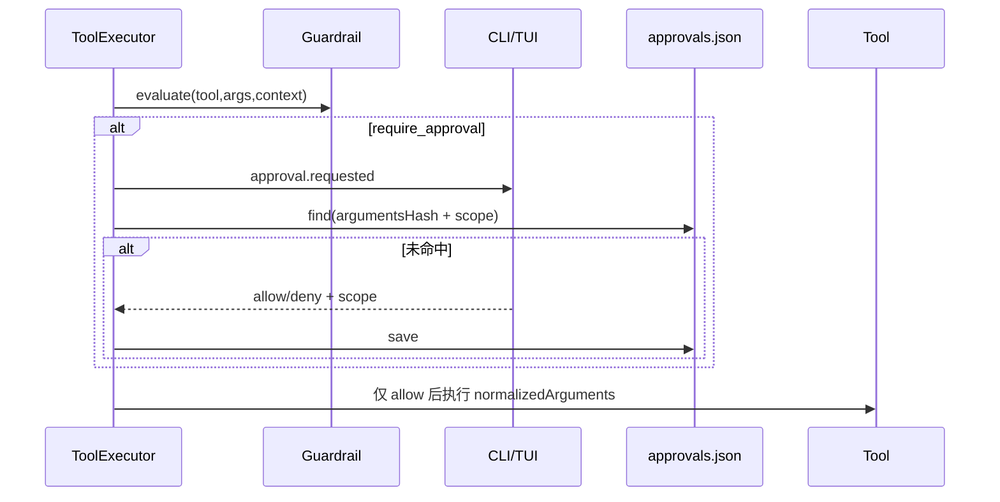

# 审批、编辑、Sandbox 与验证链路

> [返回功能链路索引](./README.md) | 适用版本：v0.7 | 更新日期：2026-09-03

## 1. 两条修改工作区的路径

### 结构化直接编辑

```text
模型 apply_patch -> ToolExecutor/Guardrail -> Patch 规范化 -> 只读预览
-> 审批 -> 再校验 workspaceRevision/文件哈希 -> 保存 EditCheckpoint
-> 应用 Patch -> 捕获 afterSnapshot -> 选择并运行验证
```

### Sandbox 生成后回放

```text
模型 shell_exec/run_tests/run_build/package_install -> 审批
-> 过滤并暂存工作区 -> Docker 隔离执行 -> 比较 baseline
-> Artifact Bundle + Patch Proposal -> apply_sandbox_patch 再次审批
-> 走同一结构化 Patch/Checkpoint/验证链路
```

命令在临时副本里产生修改，并不等于修改了宿主工作区；必须显式回放 Patch。

## 2. 审批数据流



`approvals.json` 是数组，每项含 `request` 和 `decision`。落盘 request 会把 `arguments` 清空，只保留 `argumentsHash`。

| Request 关键字段 | 含义 |
| --- | --- |
| `id/sessionId/runId/callId` | 调用归属 |
| `toolName/permission` | 审批对象 |
| `argumentsHash` | 排序稳定 JSON 的 SHA-256 |
| `workspaceRoot/workspaceRevision` | 项目和审批时版本 |
| `reasonCode/reason/createdAt/expiresAt?` | 原因和有效期 |

| Decision 字段 | 含义 |
| --- | --- |
| `decision` | allow/deny |
| `scope` | once/session/project/persistent |
| `decidedAt/ruleId?/reason?` | 决策信息 |

`once` 命中后立即消费；`session` 限同会话；`project` 限同工作区；过期或参数哈希不一致不命中。

## 3. StructuredPatch

支持操作：

| op | 必要字段 | 并发保护 |
| --- | --- | --- |
| `replace` | path、oldString、newString | oldString 唯一；可带文件哈希和上下文 |
| `overwrite` | path、content、expectedFileHash | 必须匹配旧文件哈希 |
| `create` | path、content | 目标必须不存在 |
| `delete` | path、expectedFileHash | 必须匹配旧文件哈希 |

默认上限：64 个操作、64 个文件、2 MiB 改动、20000 行。路径必须是工作区内普通相对路径，拒绝私有元数据、重解析点、ADS、短文件名、保留名和越界路径。

## 4. EditCheckpoint 数据字典

文件：`.echolens/checkpoints/<24位哈希>.json`。

| 字段 | 含义 |
| --- | --- |
| `version` | 1 |
| `workspaceRoot` | 归属工作区 |
| `workspaceRevision` | 应用前工作区快照标识 |
| `createdAt` | 创建时间 |
| `files[].path` | 被修改路径 |
| `files[].contentBase64` | 修改前内容；原文件不存在时可无 |
| `files[].existed/hash/afterHash` | 原存在性、修改前后哈希 |

回滚会校验当前文件仍等于 `afterHash`；用户在编辑后又手工改过同一文件时，不覆盖用户的新修改。

## 5. Docker Sandbox 边界

- 容器根只读、清空 Capability、禁止提权、限制 CPU/内存/PID/超时/输出。
- 命令由 `executable + args[]` 表示，`shell=false`，不解析模型拼接的 Shell 字符串。
- 默认禁网；只有 `package_install` 可申请 allowlist，经内部代理检查域名、端口、DNS 和私网地址。
- 不可用时返回 `sandbox_unavailable`，绝不回退宿主执行。
- 暂存副本排除 `.env*`、`.git`、`.echolens`、`studydocs`、依赖和构建目录、Git ignored 文件。

## 6. Artifact Bundle 数据字典

目录：`.echolens/artifacts/<bundleId>/`。

| 内容 | 说明 |
| --- | --- |
| `manifest.json` | bundle 元数据、artifacts、patch、warnings |
| `files/<path>` | 新增/修改文件或显式请求产物 |
| `before/<path>` | 删除文件的旧内容 |

Manifest 关键字段：`version/id/workspaceRoot/createdAt/artifacts[]/patch?/warnings[]`。Artifact 项含 `path/kind/change/mediaType/size/sha256/storedPath`。文本变化生成 create/overwrite/delete Patch；二进制只作为 Artifact，不自动进入 Patch。

默认限制：64 个变化文件、2 MiB Patch 内容、16 MiB Artifact 总量、最多 32 个请求路径。收集失败时删除未完成 bundle，只有完整 manifest 才可加载。

## 7. 验证链路

`selectVerificationPlan` 根据改动文件和 `package.json` 选择最小计划：

- 有 `.ts/.tsx` 且存在 script：运行 `typecheck`。
- 改到测试、`package.json` 或 `tsconfig.json`：运行 `test`。
- 都未命中但有 `test`：回退跑非强制 test。

命令按顺序执行；必需项失败后后续标为 skipped。输出脱敏并只保留末尾 4000 字符。Session 记录 `verification.completed`，最终摘要还会携带命令级状态。

## 8. 关键测试

`approval.test.ts`、`structured-patch.test.ts`、`edit-loop.test.ts`、`path-policy.test.ts`、`sandbox-tools.test.ts`、`docker-sandbox.test.ts`、`artifact-store.test.ts`、`verification.test.ts`。
