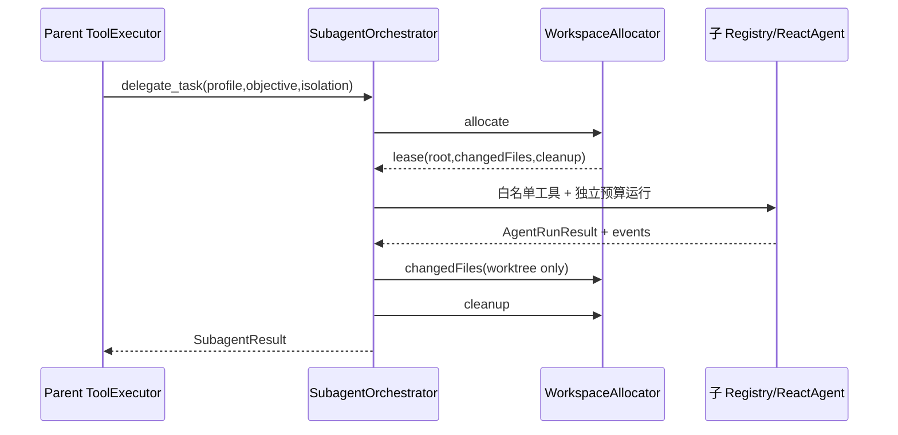
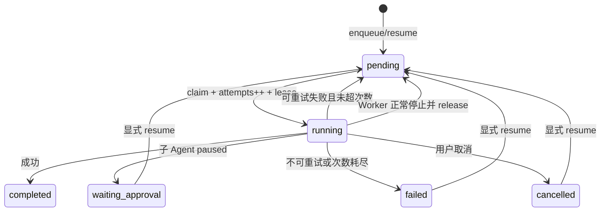

# 子 Agent、后台任务与隔离工作区链路

> [返回功能链路索引](./README.md) | 适用版本：v0.7 | 更新日期：2026-09-03

## 1. 两种委派入口

- 模型调用 `delegate_task`：当前 Run 内同步等待子 Agent 返回。
- 用户执行 `/task <profile> [sandbox|worktree] <目标>`：写入持久队列，由后台 Worker 执行。

内置 Profile：

| Profile | 工具/权限 | 步数/工具预算 | 默认隔离 |
| --- | --- | --- | --- |
| explore | 只读文件和代码智能 | 8 / 16 | sandbox |
| test | 只读 + run_tests + verify_changes | 8 / 12 | sandbox |
| review | 只读文件和代码智能 | 10 / 20 | sandbox |

Profile 工具白名单、权限和预算独立于父 Agent；子 Agent 结果只是 untrusted evidence，不能继承或扩大父级权限。

## 2. 同步子 Agent 数据流

`SubagentResult` 字段：`schemaVersion/profile/workspaceMode/state/summary/changedFiles/tests/unresolved/evidenceIds/metrics`。

## 3. 后台任务状态机

## 4. `background-tasks.json` 数据字典

顶层：`{ "version": 1, "tasks": [...] }`。

| 字段 | 含义 |
| --- | --- |
| `schemaVersion/id` | 任务 schema 和 UUID |
| `state` | pending/running/waiting_approval/completed/failed/cancelled |
| `isolation` | sandbox/worktree |
| `payload.profile/objective/metadata?` | 执行目标 |
| `createdAt/updatedAt` | 时间 |
| `attempts/maxAttempts` | 已认领次数/上限，默认上限 2 |
| `workerId/leaseExpiresAt` | 当前执行者和租约 |
| `cancellationRequested` | 取消标记 |
| `waitingReason/errorCode` | 等待或失败原因 |
| `result.summary/evidenceIds/data?` | 脱敏后的结果 |

每次读改写同时经过实例内 Promise 队列和跨进程文件锁，最后临时文件 rename。文件读取会校验版本、状态、隔离类型和记录结构。

## 5. Worker 租约

1. `claim` 找第一个 pending 任务，写 running、workerId、租约，并递增 attempts。
2. Worker 每约 `leaseMs/3` heartbeat，默认租约 60 秒。
3. heartbeat 失败视为 lease lost，立即取消当前执行，防止两个 Worker 重复跑。
4. 启动时 `recoverExpired` 把过期 running 任务恢复为 pending；已请求取消则变 cancelled。
5. Worker 正常关闭会 release 到 pending，并把本次 attempts 回退，不把关机当失败。

## 6. 隔离工作区

### sandbox

创建过滤后的临时副本。任务结束后删除，`changedFiles()` 恒为空，适合探索和测试。

### worktree

1. 先对当前主工作区生成过滤后的 baseline，包含未提交代码但排除私有/忽略文件。
2. `git worktree add --detach <temp> HEAD`。
3. 把 baseline 覆盖到 Worktree，使子 Agent 看见用户当前状态。
4. 完成后比较 baseline 与 Worktree，返回变化路径。
5. `git worktree remove --force` 并清理临时目录；必要时 prune 元数据。

当前只回传 `changedFiles` 和摘要，不自动把 Worktree 修改合并到主工作区。

## 7. CLI 操作

- `/tasks`：按创建时间倒序展示最近 20 条。
- `/task ...`：入队并唤醒 Worker。
- `/task cancel <id>`：写 cancelled，并 Abort 正在执行的任务。
- `/task resume <id>`：waiting_approval/failed/cancelled 变回 pending 并唤醒 Worker。

## 8. 关键测试

`subagent.test.ts`、`task-queue.test.ts`、`task-command.test.ts`。工作区隔离还由 Sandbox、PathPolicy 和 Artifact 相关测试交叉覆盖。
