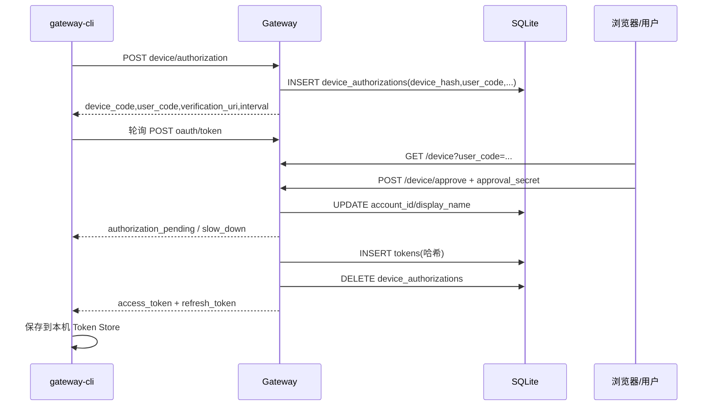
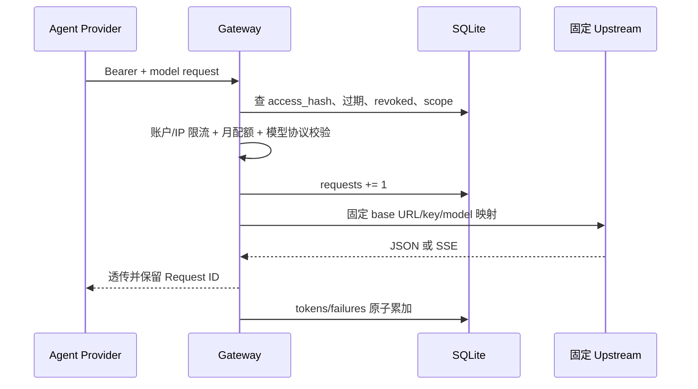

# Model Gateway 认证、代理与用量链路

> [返回功能链路索引](./README.md) | 适用版本：v0.7 | 更新日期：2026-09-03

## 1. 服务边界

Gateway 是独立 HTTP 服务，只负责认证、模型目录、固定上游代理、流式透传、限流、配额和用量。它不执行任何本地工具，也不访问 Agent 工作区。

主要端点：

| 端点 | 作用 |
| --- | --- |
| `GET /health` | 健康检查 |
| `POST /oauth/device/authorization` | 创建设备登录请求 |
| `GET /device`、`POST /device/approve` | 用户审批页面和提交 |
| `POST /oauth/token` | Device Code 换 Token、Refresh 轮换 |
| `POST /oauth/revoke` | 撤销 Token |
| `GET /v1/auth/status` | 登录能力状态 |
| `GET /v1/me` | 当前账户 |
| `GET /v1/models` | 模型目录和能力 |
| `GET /v1/usage` | 当前 UTC 月用量 |
| `POST /v1/chat/completions` | Chat Completions 代理 |
| `POST /v1/responses` | Responses 代理 |

## 2. Device Flow

Device Code 是兑换秘密，只存 SHA-256；User Code 用于人工输入，可明文存储但本身不能兑换 Token。轮询频率写入 `last_poll_at`，过快会返回 `slow_down` 并调整间隔。

## 3. Refresh 与撤销

Refresh 轮换使用 `BEGIN IMMEDIATE`：先锁定写事务，把旧 Token 行标为 revoked，再插入新 Token 行，最后 COMMIT。并发刷新只能有一个成功。

如果已 revoked 的 Refresh Token 再次出现，判定为 replay，撤销该账号所有 Token。`/oauth/revoke` 接受 Access 或 Refresh Token，匹配的一对凭据一起失效。

## 4. 推理代理链路

客户端不能用请求体改变任意上游地址或凭据。Gateway 根据服务配置的模型目录选择固定 Upstream，并对 Chat/Responses 协议进行匹配。

## 5. SQLite 表结构

数据库启动后启用 `journal_mode=WAL` 和 `foreign_keys=ON`。

### `device_authorizations`

| 列 | 约束 | 含义 |
| --- | --- | --- |
| `device_hash` | TEXT PK | Device Code SHA-256 |
| `user_code` | TEXT NOT NULL UNIQUE | 人工验证码 |
| `client_id` | TEXT NOT NULL | 客户端 ID |
| `scopes` | TEXT NOT NULL | JSON 字符串数组 |
| `expires_at` | INTEGER NOT NULL | Unix 毫秒到期时间 |
| `interval_seconds` | INTEGER NOT NULL | 轮询间隔 |
| `account_id` | TEXT NULL | 审批后账户 |
| `display_name` | TEXT NULL | 展示名 |
| `last_poll_at` | INTEGER NULL | 上次轮询时间 |

### `tokens`

| 列 | 约束 | 含义 |
| --- | --- | --- |
| `id` | INTEGER PK AUTOINCREMENT | 内部行号 |
| `access_hash` | TEXT NOT NULL UNIQUE | Access Token SHA-256 |
| `refresh_hash` | TEXT NOT NULL UNIQUE | Refresh Token SHA-256 |
| `account_id` | TEXT NOT NULL | 账户；有普通索引 |
| `display_name` | TEXT NULL | 展示名 |
| `scopes` | TEXT NOT NULL | JSON 字符串数组 |
| `access_expires_at` | INTEGER NOT NULL | Access 到期 |
| `refresh_expires_at` | INTEGER NOT NULL | Refresh 到期 |
| `revoked` | INTEGER NOT NULL DEFAULT 0 | 0 有效，1 撤销 |

数据库永远不保存 Token 明文；明文只在签发响应和请求校验的短生命周期内存在。

### `usage_monthly`

| 列 | 约束 | 含义 |
| --- | --- | --- |
| `account_id` | 复合 PK | 账户 |
| `period` | 复合 PK | UTC 月，形如 `YYYY-MM` |
| `requests` | INTEGER DEFAULT 0 | 请求数 |
| `input_tokens` | INTEGER DEFAULT 0 | 输入 Token |
| `output_tokens` | INTEGER DEFAULT 0 | 输出 Token |
| `cached_tokens` | INTEGER DEFAULT 0 | 缓存读取 Token |
| `failures` | INTEGER DEFAULT 0 | 失败数 |

用量通过 `INSERT ... ON CONFLICT(account_id,period) DO UPDATE SET value=value+excluded.value` 原子累加，避免读改写竞态。请求开始先记 requests；上游完成或断流后再记 Token/失败，因此失败请求也能计数。

## 6. 服务端内存状态

IP/账户限流窗口和部分并发控制在单实例内存中，不在 SQLite 表内。单机部署可用；水平扩展前需要迁移到共享限流/缓存基础设施，否则各实例只能看到自己的窗口。

## 7. 审计与错误

审计事件包含 Request ID、事件类型、账户、模型、协议、状态等非秘密信息，不记录 Authorization Header、Token 明文或上游 API Key。稳定错误包括认证失败、权限不足、模型不存在、协议不匹配、`rate_limited`、`quota_exceeded`、`upstream_unavailable`。

## 8. 关键测试和契约

- 服务测试：`agent-test/tests/server/model-gateway/src/server.test.ts`。
- 客户端测试：`gateway-client.test.ts`。
- 公共契约：`contracts/gateway.openapi.json`。
- 构建：`npm run gateway:build`；本地测试：`npm run gateway:test`。
