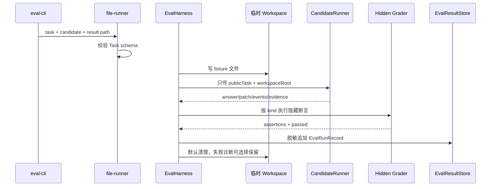

# Eval 评测与动态任务链路

> [返回功能链路索引](./README.md) | 适用版本：v0.7 | 更新日期：2026-09-03

## 1. 目标与默认边界

Eval 用本地 Task JSON 和 Candidate JSON 评估答案、Patch、终端行为和安全事件。默认不连接真实模型或付费 API；只有显式 `--docker` 才会在 Sandbox 中执行隐藏命令检查。

## 2. 单次评测数据流



Candidate 看不到 grader、fixture 定义和 generator 元数据，只得到公开任务字段，防止直接针对评分答案作弊。

## 3. Task 数据字典

| 字段 | 含义 |
| --- | --- |
| `schemaVersion` | 1 |
| `id/version/kind/title/prompt` | 任务身份和公开内容 |
| `introducedAt/lastUsedAt?` | 生命周期 |
| `leakageRisk` | low/medium/high/known_leaked |
| `tags?` | 分类 |
| `fixture.files[]` | 写入隔离工作区的文件 |
| `grader` | answer/patch/terminal/security 隐藏评分 |
| `generator?` | templateId、seed、变量，仅动态任务存在 |

`kind`：

- `answer`：exact/includes/regex 文本评分。
- `patch`：要求结构化 Patch，并可运行隐藏命令。
- `terminal`：运行命令检查退出码和输出。
- `security`：检查禁用工具、Guardrail 原因码、拒绝动作数量和可选命令。

Fixture 路径必须是安全相对路径，拒绝 `.git`、`.echolens`、`studydocs` 等私有位置。

## 4. Candidate 与结果记录

Candidate 可返回：`answer`、`patch`、`events`、`evidenceIds`、有限类型 `metadata`。

`EvalRunRecord` 字段：

| 字段 | 含义 |
| --- | --- |
| `runId/suiteId?` | 运行身份 |
| `taskId/taskVersion/taskKind` | 任务版本 |
| `startedAt/completedAt/durationMs` | 时间和耗时 |
| `passed/assertions[]` | 总结果及每条断言 |
| `evidenceIds` | 被评分证据 |
| `candidate` | 脱敏后的 CandidateResult |
| `workspaceRetained?` | 需要诊断时保留的工作区路径 |

默认结果文件 `.echolens/evals/results.jsonl`。Store 通过单写队列串行 append，每行整体脱敏并 `datasync`；读取遇到任意坏行会指出行号，不静默跳过。

## 5. 动态任务

模板变量支持 `choice` 和闭区间 `integer`。生成流程：

1. 对 seed 做 SHA-256，初始化确定性的 xorshift32。
2. 按变量名排序采样，避免对象键顺序改变结果。
3. 递归替换 `{{variable}}`。
4. 用 template ID、seed 和 variables 生成 12 位 variant 哈希。
5. 再次校验生成后的完整 Task。

同一模板和 seed 必须产生完全相同的任务 ID 和内容，便于跨运行比较。

## 6. Eval Catalog

文件结构：`{ "version": 1, "entries": [...] }`。

| 字段 | 含义 |
| --- | --- |
| `templateId` | 模板 ID |
| `introducedAt/lastUsedAt?` | 引入和最近使用时间 |
| `leakageRisk` | 泄漏风险 |
| `useCount` | 选择次数 |
| `possibleLeak?` | 是否疑似泄漏 |

选择优先级：泄漏风险低优先 -> 最久未使用优先 -> 使用次数少优先 -> ID 稳定排序。标记 possible leak 后风险至少提升为 high。Catalog 的 register/select/mark 都串行读改写并原子 rename。

## 7. 指标

`metrics.ts` 从 Session 事件计算模型步数、工具调用、拒绝、审批、Token、延迟、证据覆盖等指标，再按 suite 聚合。指标只消费稳定事件字段和错误码，不解析终端自然语言。

## 8. 命令与测试

```powershell
npm run eval:smoke
npm run eval -- --task <task.json> --candidate <candidate.json>
npm run eval -- --template <template.json> --seed <seed> --candidate <candidate.json>
```

关键测试：`eval-harness.test.ts`、`file-runner.test.ts`、`dynamic-metrics.test.ts`、`engine.test.ts`。
