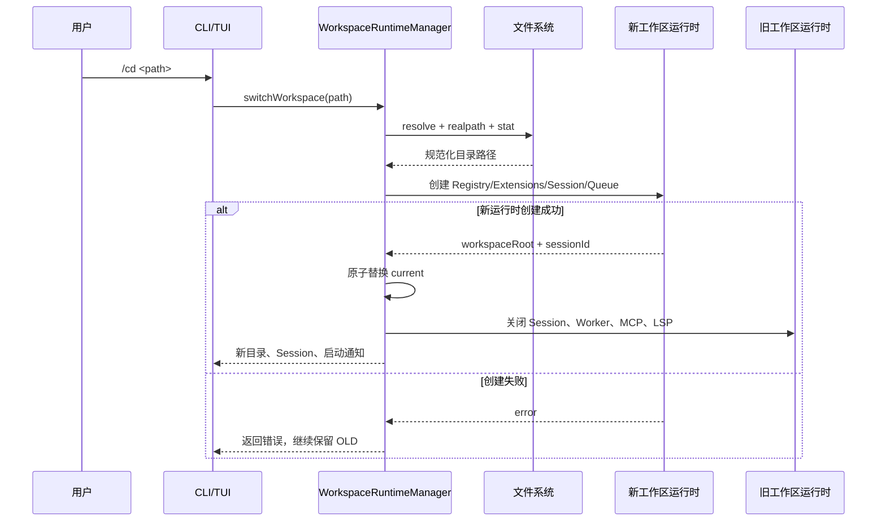

# 工作目录切换链路

> [返回功能链路索引](./README.md) | 适用版本：v0.7 | 更新日期：2026-09-04

## 1. 用户命令

| 命令 | 作用 |
| --- | --- |
| `/pwd` | 显示当前工作目录和 Session ID |
| `/workspace` | 显示当前工作目录和 Session ID |
| `/cd <path>` | 切换到指定工作目录 |
| `/workspace <path>` | `/cd` 的完整名称写法 |

路径可以是绝对路径，也可以是相对于当前工作目录的路径。包含空格的路径既可以直接作为命令剩余部分传入，也可以使用成对的单引号或双引号包裹。`~`、`~/...` 和 `~\...` 会展开为当前用户主目录。

目录切换只影响当前 Agent 进程，不修改 `.env.local` 中的 `AGENT_WORKSPACE_ROOT`。重新启动后仍以启动参数和本地配置为准。

## 2. 命令候选菜单

TUI 输入框键入 `/` 后会打开候选菜单。菜单和 `/help` 共用 `src/commands/command-catalog.ts` 中的命令目录，每个候选包含命令名、参数用法和用途说明；继续输入会按命令名、别名和说明实时过滤。

| 按键 | 行为 |
| --- | --- |
| `↑` / `↓` | 在候选中移动；菜单关闭时仍用于浏览输入历史 |
| `Tab` | 补全选中的命令；参数命令会自动追加空格 |
| `Enter` | 确认候选；无参数命令直接执行，参数命令先补全并等待参数 |
| `Esc` | 关闭候选菜单并保留当前输入 |

候选按当前上下文裁剪：运行中的 Turn 不弹菜单；没有工作区或后台任务服务时，对应命令不会显示。第一版内置命令统一注册，后续可在同一目录协议上接入 Skill、插件和 MCP 命令。

## 3. 切换数据流



## 4. 路径解析规则

1. 去除命令首尾空白和成对引号。
2. 展开用户主目录缩写 `~`。
3. 绝对路径直接使用；相对路径以当前工作目录为基准解析。
4. 使用 `realpath` 确认目标存在，并解析符号链接和规范路径。
5. 使用 `stat` 确认规范路径指向目录。
6. Windows 下比较路径时忽略大小写；目标与当前目录相同则不重建运行时。

稳定错误码：

| 错误码 | 含义 |
| --- | --- |
| `workspace_path_required` | 未提供目录路径 |
| `workspace_not_found` | 目标不存在 |
| `workspace_not_directory` | 目标是普通文件或其他非目录对象 |
| `workspace_open_failed` | 无法访问路径或新运行时初始化失败 |

## 5. 随目录切换的组件

新目录会重新创建以下工作区绑定组件：

- `ToolRegistry` 及工作区/Sandbox/代码智能/MCP/子 Agent 工具。
- `CodeIntelligenceService` 和按需启动的 TypeScript LSP。
- 当前目录 `.echolens/mcp.json` 对应的 MCP 连接。
- `.echolens/approvals.json` 对应的审批记忆。
- `.echolens/background-tasks.json` 对应的后台任务服务。
- `SubagentOrchestrator` 及其 Sandbox/Worktree 基准目录。
- `.echolens/sessions/` 下的新 `SessionRuntime`。
- 验证、Checkpoint、Artifact 和回滚使用的工作区根目录。

模型路由和已经连接的 `ModelProvider` 属于进程级资源，不因工作目录切换而重新登录或更换模型。

## 6. Session 和数据隔离

每次成功切换到不同目录都会创建一个新 Session。旧 Session 先完成落盘，再释放事件文件锁；以后切回旧目录时会再创建新 Session，用户可通过 `/sessions` 查看该目录已有会话并用启动参数恢复。

不同工作目录分别使用自己的：

```text
<workspace>/.echolens/sessions/
<workspace>/.echolens/approvals.json
<workspace>/.echolens/background-tasks.json
<workspace>/.echolens/checkpoints/
<workspace>/.echolens/artifacts/
<workspace>/.echolens/mcp.json
```

切换不会把对话历史、审批规则、后台任务、Checkpoint 或 Artifact 从旧目录复制到新目录。

## 7. 原子切换与资源回收

`WorkspaceRuntimeManager` 先完整创建新运行时，再更新 `current`。如果路径校验、Session 打开、MCP/代码智能初始化或其他创建步骤失败，新运行时会清理已经打开的部分资源，旧运行时保持可用。

切换成功后，旧运行时会并行收敛以下资源：

- 关闭 Session Event Store 并释放文件锁。
- 停止后台 Worker；运行中的任务释放回旧工作区队列。
- 关闭 MCP Client 和 TypeScript LSP。

旧资源清理失败不会把已经成功打开的新目录切回去，而是作为 warning 返回，便于用户处理残留进程或文件锁。

## 8. 交互边界

- TUI 在活动 Turn、普通命令任务或审批期间处于 busy/审批状态，不会并发提交目录切换。
- 行模式逐条读取命令，也不会在活动 Turn 中间切换。
- TUI 切换成功后立即更新页头工作目录和 Session ID，并把当前 Token 显示计数清零。
- `/sessions`、`/verify`、`/rollback`、`/task`、`/resume` 和普通提问始终转发到当前工作区运行时。

## 9. 源码与测试

- `src/runtime/workspace-manager.ts`：路径解析、命令协议、原子运行时切换。
- `src/commands/command-catalog.ts`：命令元数据、别名、说明、候选过滤和帮助文本。
- `src/cli.ts`：创建工作区运行时并提供动态代理。
- `src/tui.tsx`：命令入口和页头状态更新。
- `agent-test/tests/src/runtime/workspace-manager.test.ts`：相对/空格路径、同目录去重、失败保留旧运行时、非法路径测试。
