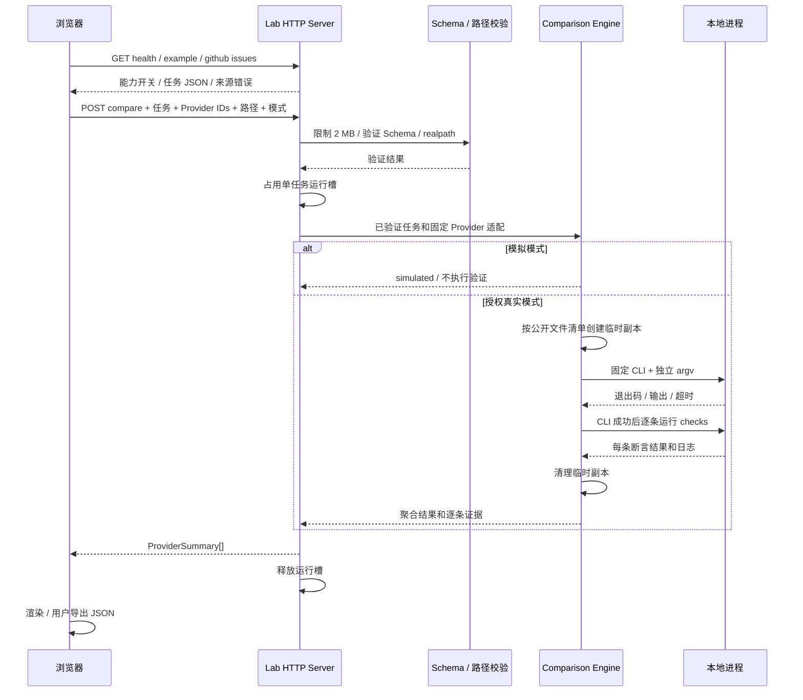

# 测试工作台与 Issue 对比链路

> [返回索引](./README.md) | 适用版本：v0.7 | 更新日期：2026-09-06

## 1. 入口与边界

运行 `npm run agent-test:web`，访问 [本地工作台](http://127.0.0.1:4317)。完整操作步骤见 [Agent Test Lab 使用指南](../../agent-test/README.md)。本模块不等同于 [Task/Candidate Eval](./07-Eval评测与动态任务.md)，二者使用不同输入契约和结果存储。

- 默认只选择本地模拟，不启动模型、CLI 或 Check 命令。
- 页面中的真实执行必须同时满足服务端环境开关和每次运行确认。
- `AGENT_TEST_REPO_ROOT` 约束可选测试仓库；质量检查始终运行 EchoLens 本仓库的 `check:ci`。
- 服务仅绑定 `127.0.0.1`，校验实际端口对应的 Host、Origin、Fetch Metadata 和 POST 请求标记。只暴露固定静态资源，不提供任意文件读取接口。

## 2. 数据流

Provider 之间可并发，同 Provider 的 Issue 顺序运行。整个服务一次只接受一个 compare 或 quality 操作，重复请求返回 409。所有 Provider 完成或清理后才释放运行槽。

## 3. HTTP 契约

| 接口 | 输入 | 输出 / 说明 |
| --- | --- | --- |
| `GET /api/health` | 无 | `ok/port/externalEnabled/active`；active 含操作种类与开始时间 |
| `GET /api/github/issues` | `repo=owner/repo&limit=1..100` | `IssueSet`，过滤 Pull Request；请求最长 15 秒 |
| `POST /api/compare` | `issueSet/providers/repoRoot/execute/confirmExternal` | `ProviderSummary[]`；Provider 仅提交已知 ID 和 enabled，忽略不了非法或重复 ID |
| `POST /api/quality` | `{}` | `passed/durationMs/output/timedOut/cancelled/truncated` |

POST 使用 `Content-Type: application/json` 和 `X-Agent-Test-Request: 1`。错误返回 `{error}`，403 表示来源或真实执行授权不满足，409 表示忙碌，413 表示请求体过大，415 表示内容类型错误，输入错误为 400。

## 4. 数据与持久化

| 数据 | 位置 / 生命周期 | 字段和用途 |
| --- | --- | --- |
| 任务集 | 浏览器 textarea；刷新丢失；可下载 JSON | repo、issues、checks；导入前校验，GitHub 失败不覆盖旧数据 |
| 运行槽 | 服务内存，单实例 | kind、startedAt；控制同机重复任务 |
| 请求取消 | 请求级 AbortController | 浏览器取消或断开后传给 Engine / CLI / Check / Quality |
| 临时副本 | 系统 temp 目录，结束后删除 | 每个 Provider/Issue 独立；排除私有/生成文件与 Git 忽略文件 |
| Provider 结果 | 服务内存返回浏览器 | providerId、mode、foundBugs、resolved、durationMs、exitCode、output、checks、verification |
| 验证结果 | `results[].checks[]` | id、passed、exitCode、output；首条失败后停止后续检查 |
| 导出报告 | 用户选择的下载位置 | version、createdAt、durationMs、execute、issueSet、providers |
| 质量日志 | 服务最多缓冲 64 KiB，返回浏览器 | 输出脱敏，截断有明确状态；可下载，不自动写数据库 |
| 浏览器验收截图 | `.echolens/web-check/`，Git 忽略 | 桌面、平板、手机及结果视图，仅本地验证产物 |

本模块没有数据库表，也不自动写入 Session JSONL 或 EvalResultStore。页面刷新不会恢复上次任务；服务重启也不会恢复运行槽。

## 5. 验证语义

| verification | 含义 |
| --- | --- |
| simulated | 没有执行模型或验证；关键词计数不代表真实能力 |
| passed | CLI 正常退出且非空 Checks 全部通过 |
| failed | 存在失败 Check；日志包含具体退出码和断言输出 |
| missing | CLI 正常退出，但没有 Checks，不能计为解决 |
| not-run | CLI/准备步骤失败，未完成验证 |

发现数仍是自报/关键词启发式，前端明确标注，不能作为独立准确率。平均任务耗时包含副本准备、CLI 和 Checks，模拟模式不展示伪造耗时或解决率。

## 6. 安全与失败恢复

1. Schema 在复制和进程启动前验证，包括 ID 唯一性、字段类型、数量上限、验证超时和相对 cwd。
2. 工作区与 Check cwd 使用真实路径检查，拒绝逃出允许根目录的链接；快照使用现有 PathPolicy 的文件读取能力。
3. 临时副本是数据复制，不是 OS 沙箱。CLI 与验证仍可拥有当前用户权限；Shell 禁用不能阻止可信 executable 自身做危险操作。
4. 子进程 stdin 关闭、日志有界、输出尽力脱敏。取消与超时尝试结束 Windows 进程树或 POSIX 进程组，停止无法确认时明确报错。
5. 前端检查 HTTP 状态，操作使用 try/catch/finally；失败释放按钮状态，错误 JSON 不写入任务编辑器。
6. 结果使用转义或 textContent 展示，不把 Issue/CLI 输出当 HTML 执行。真实执行确认不能被导入任务中的布尔字段替代。

## 7. 验证与依据

- `agent-test/tests/agent-test/engine.test.ts`：HTTP、Schema、来源、并发、断开取消、路径、进程与断言回归，全用本地替身。
- `agent-test/scripts/verify-web.mjs`：Playwright 验证导入导出、模拟、错误保留、取消、注入与响应式布局。
- [MDN Fetch](https://developer.mozilla.org/en-US/docs/Web/API/Fetch_API/Using_Fetch)：HTTP 状态和 AbortController。
- [Node Child Process](https://nodejs.org/api/child_process.html)：独立 argv、进程退出与信号语义。
- [GitHub Issues](https://docs.github.com/en/rest/issues/issues)：分页结果包含 Pull Request，需单独过滤。
