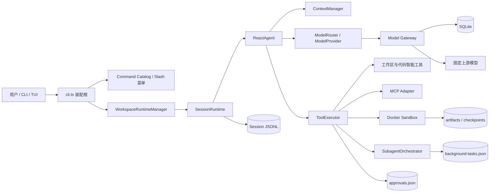

# EchoLens Agent 功能链路总览与数据字典

> 适用版本：v0.7。更新日期：2026-09-03。本文档描述公开仓库当前实现。

## 1. 这套文档怎么用

本目录按“用户触发一个功能后，数据经过哪些模块、在哪里落盘、失败后怎样恢复”组织，不按源码目录逐文件复述。

| 文档 | 覆盖的用户动作 | 核心状态 |
| --- | --- | --- |
| [启动、配置、凭据与模型路由](./01-启动配置凭据与模型路由.md) | 首次设置、启动、Direct/Gateway 选路 | `.env.local`、Gateway Token Store |
| [对话运行、工具调用与会话恢复](./02-对话运行工具调用与会话恢复.md) | 提问、工具调用、暂停、取消、恢复、steering | Session JSONL、AgentCheckpoint |
| [规则、上下文、MCP 与代码智能](./03-规则上下文MCP与代码智能.md) | 加载 AGENTS.md、压缩上下文、调用 MCP、查符号 | `.echolens/mcp.json`、内存目录与 LSP 状态 |
| [审批、编辑、Sandbox 与验证](./04-审批编辑Sandbox与验证.md) | 审批、改文件、跑命令、回放 Sandbox 修改、回滚、验证 | approvals、checkpoints、artifacts、sandboxes |
| [子 Agent、后台任务与隔离工作区](./05-子Agent后台任务与隔离工作区.md) | 委派 Explore/Test/Review、后台排队、取消和恢复 | background-tasks、租约、临时 Worktree |
| [Model Gateway 认证、代理与用量](./06-Model-Gateway认证代理与用量.md) | 登录、刷新、注销、模型发现、推理代理、限流和配额 | SQLite 三张表、客户端 Token Store |
| [Eval 评测与动态任务](./07-Eval评测与动态任务.md) | 运行本地评测、隐藏评分、动态题目轮换 | results.jsonl、catalog.json |
| [工作目录切换](./08-工作目录切换.md) | 查看目录、切换目录、命令候选、隔离 Session 和运行时资源 | 当前运行时引用；每个目录独立 `.echolens/` |

## 2. 总体数据流

## 3. 持久化总表

| 位置 | 格式 | 写入方 | 读取方 | 内容 | 一致性策略 |
| --- | --- | --- | --- | --- | --- |
| `.env.local` | KEY=VALUE | `startup-config.ts`、`gateway-cli.ts` | Node `loadEnvFile`、`ModelRouter` | 本地路由和非 Gateway 直连配置 | 临时文件加 rename；拒绝换行注入 |
| `.echolens/sessions/<sessionId>.jsonl` | JSONL | `JsonlEventStore` | `SessionRuntime`、CLI/TUI | Session、Turn、模型、工具、审批、检查点、用量事件 | 跨进程文件锁、单写队列、连续 seq、关键事件 datasync |
| `.echolens/approvals.json` | JSON 数组 | `JsonApprovalStore` | `ToolExecutor` | 审批请求摘要和决策 | 进程内串行、临时文件加 rename、参数只存哈希 |
| `.echolens/checkpoints/<id>.json` | JSON | `saveEditCheckpoint` | 回滚命令 | 编辑前文件内容、哈希和工作区版本 | 内容哈希 ID、0600、工作区归属校验 |
| `.echolens/artifacts/<bundleId>/manifest.json` | JSON + 文件 | `collectSandboxArtifacts` | `apply_sandbox_patch` | Sandbox 文件变化、请求产物、结构化 Patch | 先完整收集再写 manifest；失败删除半成品目录 |
| `.echolens/sandboxes/<id>/` | 临时目录 | `FileSystemWorkspaceStager` | Docker Adapter | 过滤后的工作区副本与 baseline | 排除秘密/私有/忽略文件；执行后清理 |
| `.echolens/background-tasks.json` | JSON 对象 | `PersistentTaskQueue` | Worker、CLI/TUI | 后台任务、状态、租约、重试和结果 | 进程内串行、跨进程锁、临时文件加 rename |
| `.echolens/mcp.json` | JSON | 用户/部署配置 | `loadMcpConfig` | MCP Server、Transport、权限引用 | 路径/结构/秘密引用校验；只读加载 |
| Windows `%LOCALAPPDATA%/EchoLens/gateway-token.dpapi` | DPAPI 密文 | Gateway CLI/Resolver | Gateway Credential Resolver | Access/Refresh Token 和过期时间 | 用户级 DPAPI、原子替换；明文不进命令行 |
| 非 Windows `~/.echolens/gateway-token.json` | 0600 JSON | 同上 | 同上 | 同上 | 文件权限加原子替换 |
| `.echolens/evals/results.jsonl` | JSONL | `EvalResultStore` | 指标和历史读取 | 每次评测结果 | 串行追加、整体脱敏、datasync |
| Eval Catalog 自定义路径 | JSON | `EvalTaskCatalog` | 动态题目选择 | 模板使用次数、泄漏风险、最近使用时间 | 串行读改写、原子替换 |
| Gateway 数据库路径 | SQLite/WAL | `GatewayStateStore` | Gateway HTTP Server | 设备授权、Token 哈希、月度用量 | 单连接、事务、唯一键、UPSERT |

## 4. 存储方案比较与推荐

| 方案 | 优点 | 局限 | 当前推荐用途 |
| --- | --- | --- | --- |
| JSONL 追加日志 | 写入模型简单；天然审计；崩溃后可按事件重放 | 查询和聚合弱；需要严格序号和损坏检测 | Session 事件、Eval 结果 |
| 单 JSON 快照 | 易查看；结构简单；适合整体替换 | 并发读改写容易丢更新；文件越大写放大越明显 | 审批记忆、后台任务小队列、Eval Catalog |
| SQLite | 事务、唯一约束、索引、原子 UPSERT，适合状态查询和聚合 | 要管理 schema、迁移和并发模型 | Gateway 认证、令牌轮换、额度与用量 |

推荐继续保持当前分工：Agent 本地运行态优先使用可检查、可恢复的文件；服务端涉及并发刷新、唯一性和计数聚合时使用 SQLite。后台任务量或多 Worker 规模明显增长后，再把 `background-tasks.json` 迁移为 SQLite/服务端队列，而不是提前引入数据库。

技术基线参考：[SQLite WAL](https://www.sqlite.org/wal.html)、[SQLite Transactions](https://www.sqlite.org/lang_transaction.html)、[Node.js `node:sqlite`](https://nodejs.org/api/sqlite.html)、[MCP Specification](https://modelcontextprotocol.io/specification) 和 [OpenAI Responses API](https://platform.openai.com/docs/api-reference/responses)。实现细节以仓库代码和 `contracts/gateway.openapi.json` 为准。

## 5. 统一安全不变量

1. 模型不能直接访问文件系统、进程或网络，所有动作必须经过 `ToolExecutor`。
2. 仓库规则只能收紧权限或要求审批，不能授予新权限或覆盖 System Policy。
3. 工具、MCP、子 Agent 和模型输出都按不可信数据处理，落盘前统一脱敏。
4. `.git`、`.echolens`、`.env*`、`studydocs` 等私有目录不进入模型可读工作区或 Sandbox Artifact。
5. 编辑必须绑定预览时的文件哈希/工作区版本，审批后发现工作区变化就拒绝应用。
6. Gateway 只代理模型请求，不读取本地工作区，也不能执行本地工具。

## 6. 排查顺序

1. 先看界面错误码和当前状态。
2. 对话问题按 `sessionId -> turnId -> runId -> seq` 查 Session JSONL。
3. 工具未执行时先看 `guardrail.decision`、`approval.*`，再看 `tool.completed.error.code`。
4. Sandbox 修改未回写时检查 bundle manifest、Patch 预览和 Checkpoint。
5. 后台任务卡住时看 `state/workerId/leaseExpiresAt/cancellationRequested/attempts`。
6. Gateway 问题按 Request ID 对齐审计事件，再查 Token/Usage 表；不要输出令牌明文或数据库秘密。
7. 目录切换失败时先看 `workspace_*` 错误码；新目录初始化失败不会关闭旧工作区。

## 7. 文档维护约定

- 新功能应补充入口、数据流、持久化结构、状态迁移、失败恢复和测试位置。
- 修改事件字段、文件结构、SQLite schema 或公开 HTTP 契约时，应同步更新对应链路文档。
- 文档只引用公开仓库内容；真实凭据、服务器地址、部署秘密和本地环境信息不得写入本目录。
- 公开接口以 `contracts/` 和源码为准，文档用于解释链路和数据语义。
